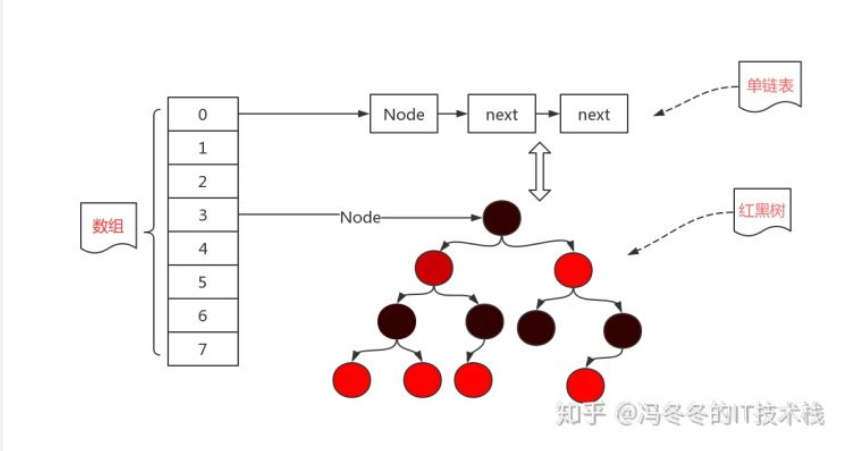
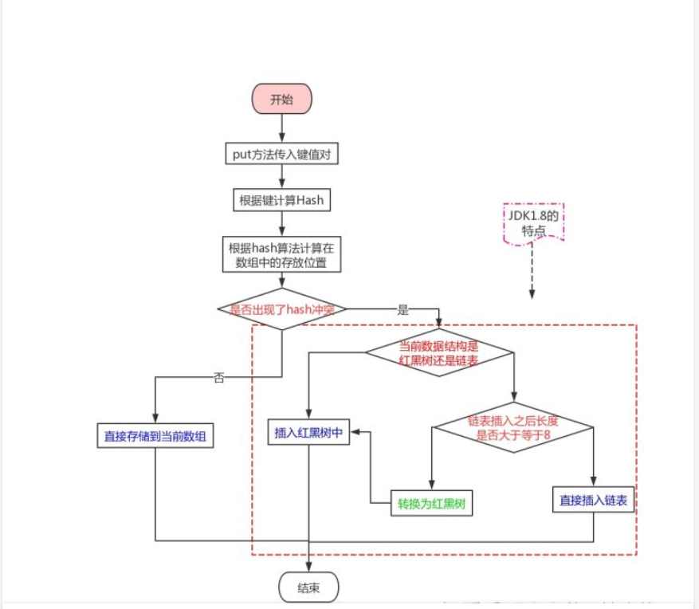
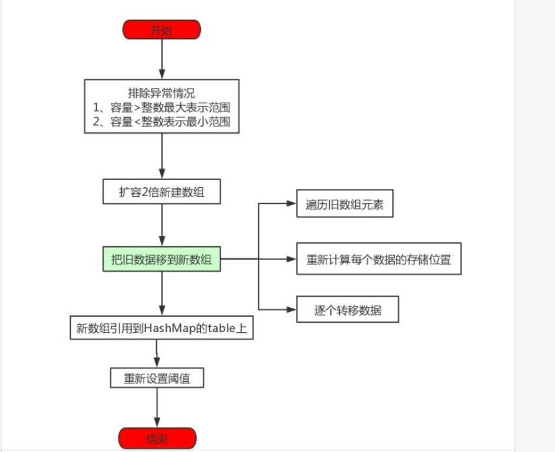

## HashMap原理

### HashMap底层数据结构
- java1.7及之前版本：数组+链表
- java1.8及之后版本：数组+链表+红黑树
 如下图

首先我们先了解一下上面提到的三种数据结构的特性，为什么hashmap会用到这三种数据结构。
- 数组：查询的时间复杂度为O(1)，查询效率高；插入和删除困难
- 链表：查询的时间复杂度为O(n)，查询低效：插入和删除容易
- 红黑树：查询的时间复杂度为O(logn)，增删查改介于数组和链表之间，但是维护复杂

### HashMap增删改查的实现原理

下面是插入数据的整个流程：
- 第一步：调用put方法传入键值对
- 第二步：使用调用hashCode()计算hash值
- 第三步：根据hash值确定存放的位置，判断是否和其他键值对位置发生了冲突
- 第四步：若没有发生冲突，直接存放在数组中即可
- 第五步：若发生了冲突，还要判断此时的数据结构是什么？
- 第六步：若此时的数据结构是红黑树，那就直接插入红黑树中
- 第七步：若此时的数据结构是链表，判断插入之后是否大于等于8
- 第八步：插入之后大于8了，就要先调整为红黑树，在插入
- 第九步：插入之后不大于8，那么就直接插入到链表尾部即可。
 > 其中有几个地方需要注意
 > - 如何确定在数组中的下标：通过hashCode计算出key的hash值之后，通过（n-1）&hash运算得到存放在数组中的位置，n表示hashmap的初始容量，即数组的初始长度，将计算出的hash值与n-1做与运算得出存在的数组下标。
 > - 初始容量为什么是16，为什么要通过（n-1）&hash运算确定数组下标：当计算出key的hash值时，
 > 我们需要将key均匀的分布到数组上，也就是需要为每一个key值给定一个数组下标，这个下标需要在> 0到n-1之间，首先我们想到的是取模运算，Java之所有使用位运算(&)来代替取模运算(%)，最主要的考虑就是效率。位运算(&)效率要比代替取模运算(%)高很多，主要原因是位运算直接对内存数据进行操作，不需要转成十进制，因此处理速度非常快。初始容量n设置为2的n次幂，是为了便于做与运算，2的n次幂-1的到二进制数全为1,如7的二进制表示为111，任何整数与它做与运算得到的值都会在0-7这个区区间，至于为什么是16,我想应该是经验值，至今没有找到官方解释。
 > - 为什么是红黑树而不是AVL(平衡二叉树)树：见[AVL树和红黑树的区别](https://blog.csdn.net/u010899985/article/details/80981053)
 > - 为什么链表长度达到8时转为红黑树： 

### HashMap如何实现扩容
为什么扩容呢？当向容器添加元素的时候，会判断当前容器的元素个数，如果大于等于阈值—即当前数组的长度乘以加载因子的值的时候，就要自动扩容。

这里需要有两个名字介绍一下：
- initialCapacity初始容量：即上文中的n ,官方要求我们要输入一个2的N次幂的值，比如说2、4、8、16等等这些，但是我们忽然一个不小心，输入了一个20怎么办？没关系，虚拟机会根据你输入的值，找一个离20最近的2的N次幂的值，比如说16离他最近，就取16为初始容量,取2的那次幂主要是为了方便取模
- loadFactor负载因子：负载因子，默认值是0.75。负载因子表示一个散列表的空间的使用程度，有这样一个公式：initailCapacity*loadFactor=HashMap的容量。 所以负载因子越大则散列表的装填程度越高，也就是能容纳更多的元素，元素多了，链表大了，所以此时索引效率就会降低。反之，负载因子越小则链表中的数据量就越稀疏，此时会对空间造成烂费，但是此时索引效率高

### HashMap为什么非线程安全
- put的时候导致的多线程数据不一致：这个问题比较好想象，比如有两个线程A和B，首先A希望插入一个key-value对到HashMap中，首先计算记录所要落到的桶的索引坐标，然后获取到该桶里面的链表头结点，此时线程A的时间片用完了，而此时线程B被调度得以执行，和线程A一样执行，只不过线程B成功将记录插到了桶里面，假设线程A插入的记录计算出来的桶索引和线程B要插入的记录计算出来的桶索引是一样的，那么当线程B成功插入之后，线程A再次被调度运行时，它依然持有过期的链表头但是它对此一无所知，以至于它认为它应该这样做，如此一来就覆盖了线程B插入的记录，这样线程B插入的记录就凭空消失了，造成了数据不一致的行为
- 多线程环境下有出现死循环的可能，参考[Hashmap死循环]（https://blog.csdn.net/Kevin_King1992/article/details/79859290）