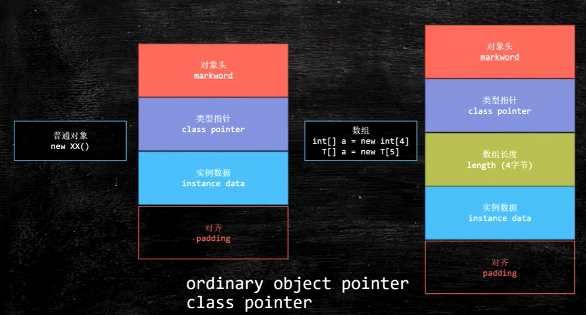
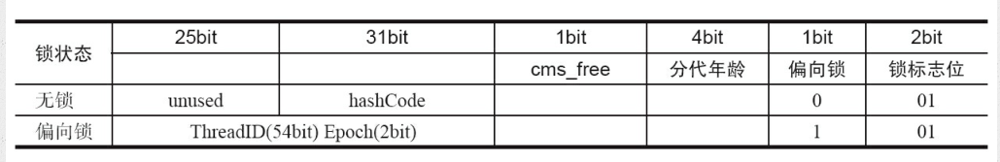
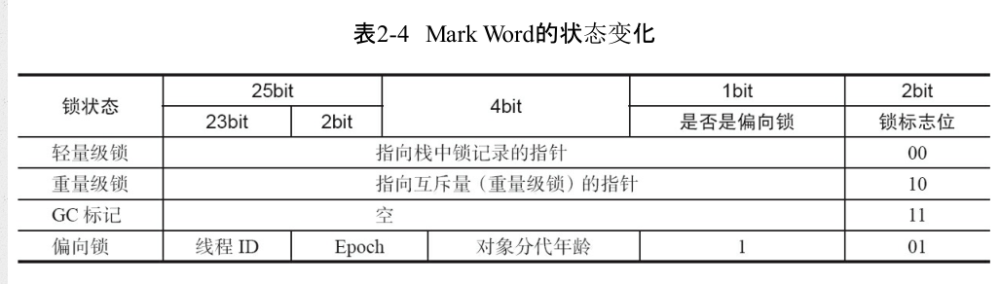

## synchronized的实现原理和应用

### synchronize
利用synchronized实现同步的基础：java中每一个对象都可以作为锁，具体表现为以下三种形式：
- 普通同步方法：锁是当前实例的对象
- 静态同步方法：锁的是当前类的Class对象
- 同步方法块：锁的是synchronized括号里配置的对象

### synchronize底层语义原理
理解synchronized首先需要了解一下java对象的内存结构，如图：

java对象的内存模型主要分为三部分(长度区分32位和64位操作系统)
|长度|内容|说明|
|---|---|---|
|32bit/64bit| markword|对象头，存储对象的hashCode或锁信息|
|32bit/64bit| class metadata address|对象类型数据的指针|
|32bit/64bit| instance data|实例数据|
|不确定| padding|对齐|

markword在64位JVM下的存储结构

markword的状态变化

