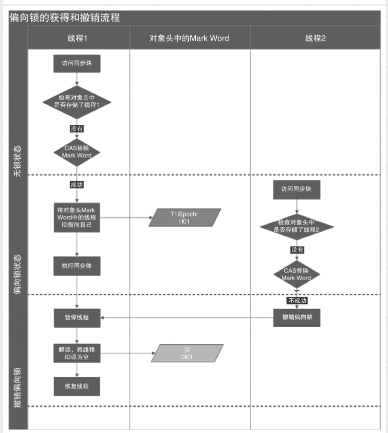
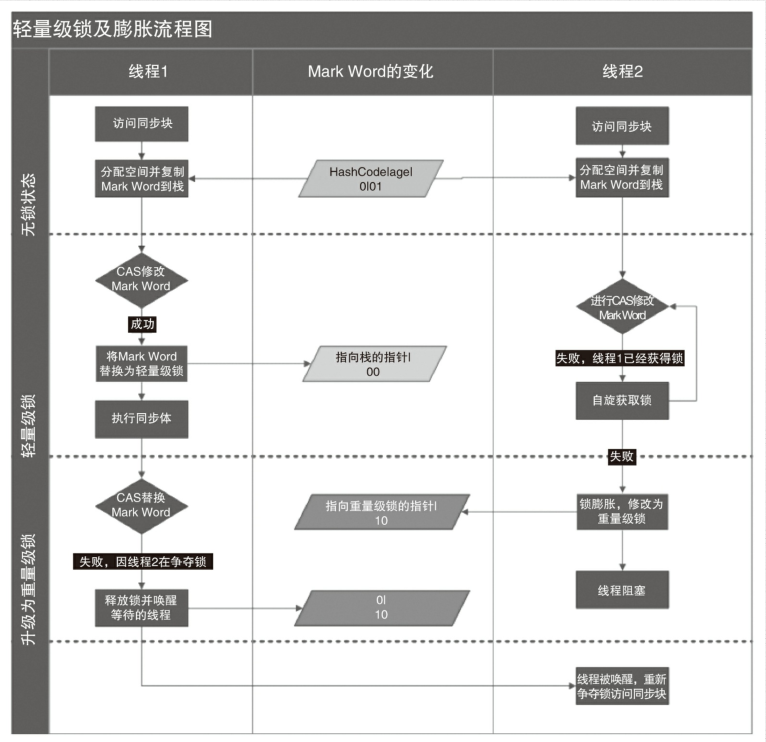
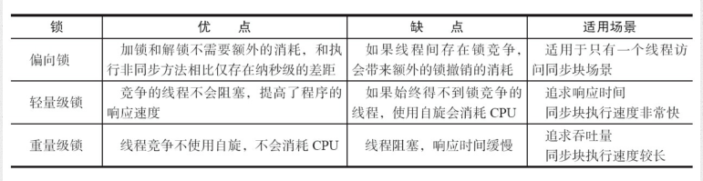

## 锁的升级与变化

java1.6为了减少获得和释放带来的性能消耗，引入了偏向锁和轻量级锁，在java1.6中，锁一共有四种状态，级别从低到高依次是：无锁状态，偏向锁，轻量级锁和重量级锁，这几种状态会随着竞争逐渐升级，锁可以升级但不能降级。

#### 1.偏向锁
HotSpot [1] 的作者经过研究发现，大多数情况下，锁不仅不存在多线程竞争，而且总是由同
一线程多次获得，为了让线程获得锁的代价更低而引入了偏向锁。当一个线程访问同步块并
获取锁时，会在对象头和栈帧中的锁记录里存储锁偏向的线程ID，以后该线程在进入和退出
同步块时不需要进行CAS操作来加锁和解锁，只需简单地测试一下对象头的Mark Word里是否
存储着指向当前线程的偏向锁。如果测试成功，表示线程已经获得了锁。如果测试失败，则需
要再测试一下Mark Word中偏向锁的标识是否设置成1（表示当前是偏向锁）：如果没有设置，则
使用CAS竞争锁；如果设置了，则尝试使用CAS将对象头的偏向锁指向当前线程

- 偏向锁的撤销:偏向锁使用了一种等到竞争出现才释放锁的机制，所以当其他线程尝试竞争偏向锁时，
持有偏向锁的线程才会释放锁。偏向锁的撤销，需要等待全局安全点（在这个时间点上没有正
在执行的字节码）。它会首先暂停拥有偏向锁的线程，然后检查持有偏向锁的线程是否活着，
如果线程不处于活动状态，则将对象头设置成无锁状态；如果线程仍然活着，拥有偏向锁的栈
会被执行，遍历偏向对象的锁记录，栈中的锁记录和对象头的Mark Word要么重新偏向于其他
线程，要么恢复到无锁或者标记对象不适合作为偏向锁，最后唤醒暂停的线程。图2-1中的线
程1演示了偏向锁初始化的流程，线程2演示了偏向锁撤销的流程。

- 关闭偏向锁：偏向锁在Java 6和Java 7里是默认启用的，但是它在应用程序启动几秒钟之后才激活，如有必要可以使用JVM参数来关闭延迟：-XX:BiasedLockingStartupDelay=0。如果你确定应用程
序里所有的锁通常情况下处于竞争状态，可以通过JVM参数关闭偏向锁：-XX:-
UseBiasedLocking=false，那么程序默认会进入轻量级锁状态。

#### 2.轻量级锁
- 轻量级锁加锁：线程在执行同步块之前，JVM会先在当前线程的栈桢中创建用于存储锁记录的空间，并
将对象头中的Mark Word复制到锁记录中，官方称为Displaced Mark Word。然后线程尝试使用
CAS将对象头中的Mark Word替换为指向锁记录的指针。如果成功，当前线程获得锁，如果失
败，表示其他线程竞争锁，当前线程便尝试使用自旋来获取锁。
- 轻量级锁解锁：轻量级解锁时，会使用原子的CAS操作将Displaced Mark Word替换回到对象头，如果成功，则表示没有竞争发生。如果失败，表示当前锁存在竞争，锁就会膨胀成重量级锁。图2-2是
两个线程同时争夺锁，导致锁膨胀的流程图。

因为自旋会消耗CPU，为了避免无用的自旋（比如获得锁的线程被阻塞住了），一旦锁升级
成重量级锁，就不会再恢复到轻量级锁状态。当锁处于这个状态下，其他线程试图获取锁时，
都会被阻塞住，当持有锁的线程释放锁之后会唤醒这些线程，被唤醒的线程就会进行新一轮
的夺锁之争

#### 锁的优缺点对比 
