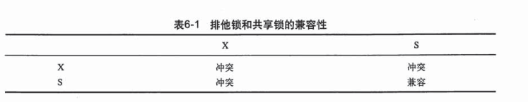

## mysql中的锁(InnoDB)

### 行级锁
1. 共享锁（S lock）:允许事务读一行数据
2. 排它锁（X lock）:允许事务更新或删除一条数据

### 表级锁
1. lock/unlock tables … read/write ：lock tables 语法除了会限制别的线程的读写外，也限定了本线程接下来的操作对象,一般不使用。
2. MDL(medadata lock)：不需要显示使用，在访问一个表的时候会被自动加上。
    - 作用:在 MySQL 5.5 版本中引入了 MDL，当对一个表做增删改查操作的时候，加 MDL 读锁;当要对表做结构变更操作的时候，加 MDL 写锁;
    - 读锁之间不互斥，因此你可以有多个线程同时对一张表增删改查;
    - 读写锁之间、写锁之间是互斥的，用来保证变更表结构操作的安全性。因此，如果有两个线程要同时给一个表加字段，其中一个要等另一个执行完才能开始执行
    - 注意点：表结构变更会阻塞对该表的查询,MDL本质上作用是为了防止DDL和DML之间的并发冲突