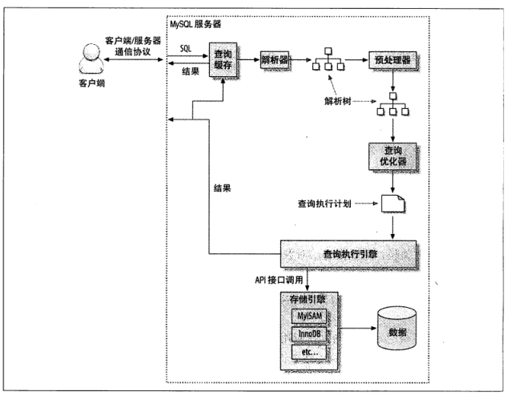

## mysql查询执行过程

### 一、流程图 
1. 高性能mysql中的执行示意图

2. 极客时间专栏mysql查询执行示意图
.png)

### 二、执行过程
1. 连接器：客户端与服务器建立连接。
2. 客户端发送一条查询语句给服务器。
3. 服务器查询缓存，命中缓存，则直接返回；否则进入下一阶段。
4. 分析器：词法分析，语法分析
5. 优化器：生成执行计划，索引选择
6. 执行器：操作引擎，返回结果
7. 存储引擎：存储数据，提供读写接口

